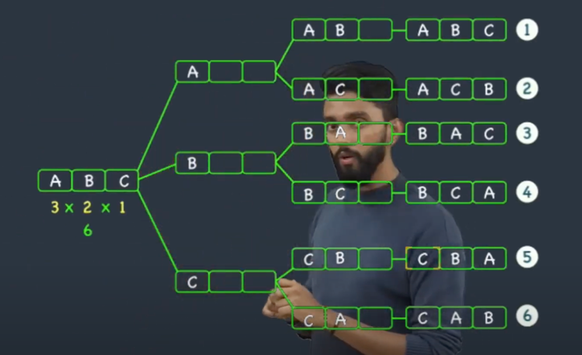
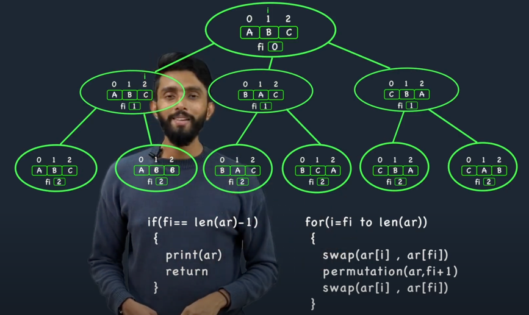

# Recursion

[Resource](https://takeuforward.org/recursion/introduction-to-recursion-understand-recursion-by-printing-something-n-times/)

### 1. Print all the permutations

[Vedio explanation](https://www.youtube.com/watch?v=vKQ6oUH02gw)

